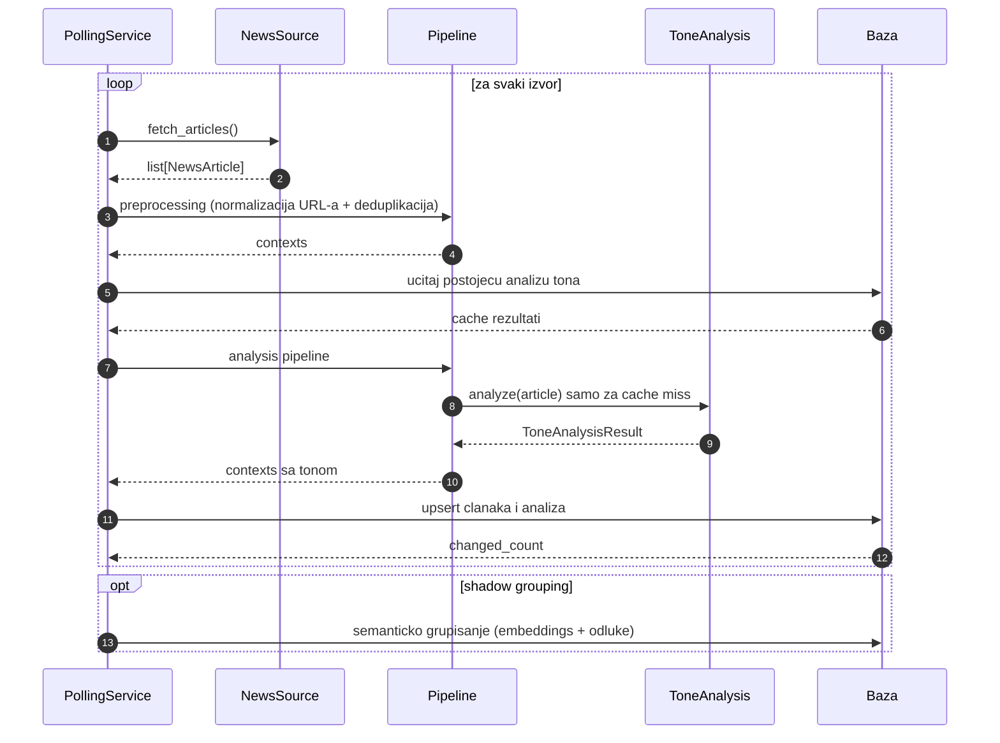

# Sekvencijalni dijagram obrade vesti (pipeline)

Jedan ciklus `NewsSourcePollingService.refresh_once()`.

```mermaid
sequenceDiagram
    autonumber
    participant Poll as PollingService
    participant Src as NewsSource
    participant Pipe as Pipeline
    participant LLM as ToneAnalysis
    participant DB as Baza

    loop za svaki izvor
        Poll->>Src: fetch_articles()
        Src-->>Poll: list[NewsArticle]

        Poll->>Pipe: preprocessing (normalizacija URL-a + deduplikacija)
        Pipe-->>Poll: contexts

        Poll->>DB: ucitaj postojecu analizu tona
        DB-->>Poll: cache rezultati

        Poll->>Pipe: analysis pipeline
        Pipe->>LLM: analyze(article) samo za cache miss
        LLM-->>Pipe: ToneAnalysisResult
        Pipe-->>Poll: contexts sa tonom

        Poll->>DB: upsert clanaka i analiza
        DB-->>Poll: changed_count
    end

    opt shadow grouping
        Poll->>DB: semanticko grupisanje (embeddings + odluke)
    end
```
