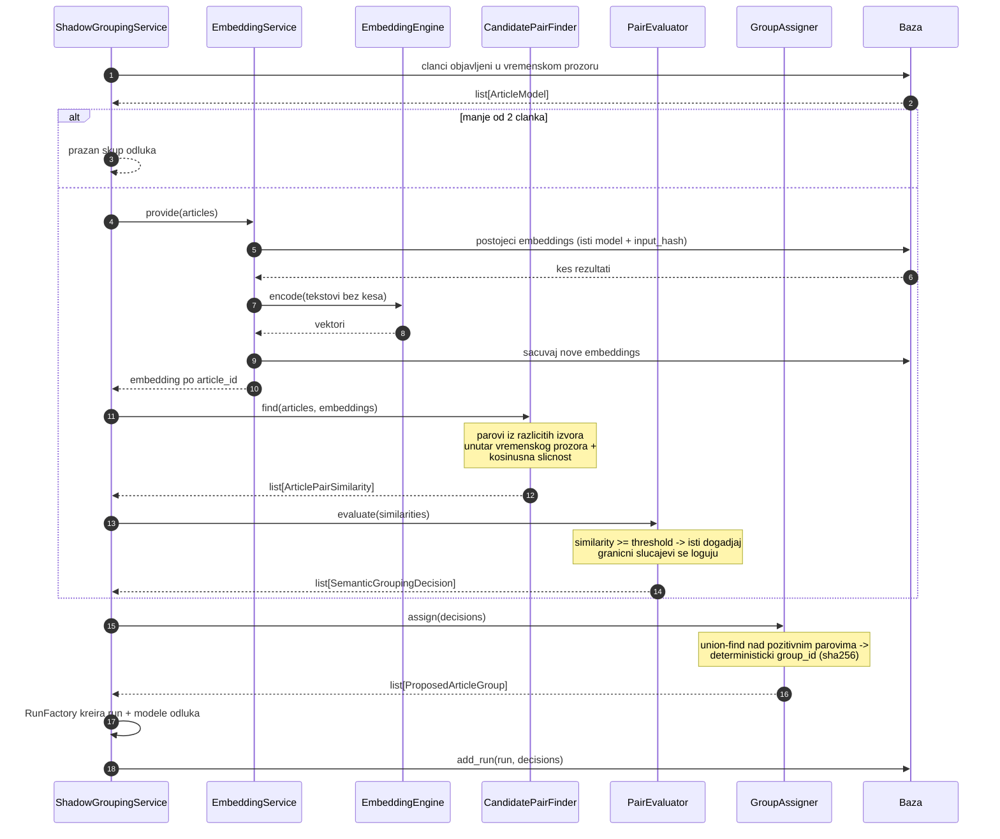

# Sekvencijalni dijagram kreiranja semantickih grupa

Jedan ciklus `ShadowSemanticGroupingService.run()` (shadow mod).

```mermaid
sequenceDiagram
    autonumber
    participant Svc as ShadowGroupingService
    participant Emb as EmbeddingService
    participant Eng as EmbeddingEngine
    participant Pair as CandidatePairFinder
    participant Eval as PairEvaluator
    participant Asgn as GroupAssigner
    participant DB as Baza

    Svc->>DB: clanci objavljeni u vremenskom prozoru
    DB-->>Svc: list[ArticleModel]

    alt manje od 2 clanka
        Svc-->>Svc: prazan skup odluka
    else
        Svc->>Emb: provide(articles)
        Emb->>DB: postojeci embeddings (isti model + input_hash)
        DB-->>Emb: kes rezultati
        Emb->>Eng: encode(tekstovi bez kesa)
        Eng-->>Emb: vektori
        Emb->>DB: sacuvaj nove embeddings
        Emb-->>Svc: embedding po article_id

        Svc->>Pair: find(articles, embeddings)
        Note over Pair: parovi iz razlicitih izvora<br/>unutar vremenskog prozora +<br/>kosinusna slicnost
        Pair-->>Svc: list[ArticlePairSimilarity]

        Svc->>Eval: evaluate(similarities)
        Note over Eval: similarity >= threshold -> isti dogadjaj<br/>granicni slucajevi se loguju
        Eval-->>Svc: list[SemanticGroupingDecision]
    end

    Svc->>Asgn: assign(decisions)
    Note over Asgn: union-find nad pozitivnim parovima -><br/>deterministicki group_id (sha256)
    Asgn-->>Svc: list[ProposedArticleGroup]

    Svc->>Svc: RunFactory kreira run + modele odluka
    Svc->>DB: add_run(run, decisions)
```
