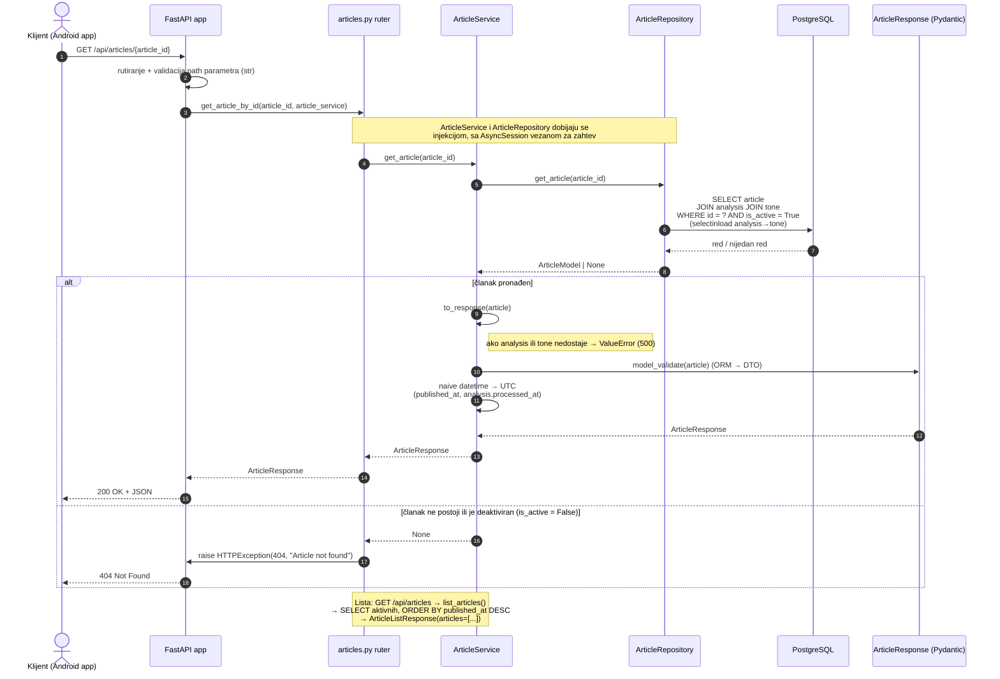

# Dohvatanje artikla preko API-ja

Sekvencijalni dijagram obrade HTTP zahteva `GET /api/articles/{article_id}`
(i varijante `GET /api/articles` za listu).

```mermaid
sequenceDiagram
    autonumber
    actor Client as Klijent (Android app)
    participant API as FastAPI app
    participant Route as articles.py ruter
    participant Svc as ArticleService
    participant Repo as ArticleRepository
    participant DB as PostgreSQL
    participant Schema as ArticleResponse (Pydantic)

    Client->>API: GET /api/articles/{article_id}
    API->>API: rutiranje + validacija path parametra (str)
    API->>Route: get_article_by_id(article_id, article_service)
    Note over Route,Repo: ArticleService i ArticleRepository dobijaju se<br/>injekcijom, sa AsyncSession vezanom za zahtev

    Route->>Svc: get_article(article_id)
    Svc->>Repo: get_article(article_id)
    Repo->>DB: SELECT article<br/>JOIN analysis JOIN tone<br/>WHERE id = ? AND is_active = True<br/>(selectinload analysis→tone)
    DB-->>Repo: red / nijedan red
    Repo-->>Svc: ArticleModel | None

    alt članak pronađen
        Svc->>Svc: to_response(article)
        Note right of Svc: ako analysis ili tone nedostaje → ValueError (500)
        Svc->>Schema: model_validate(article) (ORM → DTO)
        Svc->>Svc: naive datetime → UTC<br/>(published_at, analysis.processed_at)
        Schema-->>Svc: ArticleResponse
        Svc-->>Route: ArticleResponse
        Route-->>API: ArticleResponse
        API-->>Client: 200 OK + JSON
    else članak ne postoji ili je deaktiviran (is_active = False)
        Svc-->>Route: None
        Route->>API: raise HTTPException(404, "Article not found")
        API-->>Client: 404 Not Found
    end

    Note over Route,Svc: Lista: GET /api/articles → list_articles()<br/>→ SELECT aktivnih, ORDER BY published_at DESC<br/>→ ArticleListResponse(articles=[...])
```

