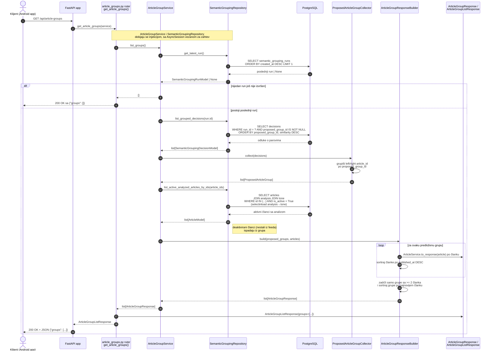

# Dohvatanje semantičkih grupa preko API-ja

Sekvencijalni dijagram obrade HTTP zahteva `GET /api/article-groups`.
Grupe se ne računaju tokom zahteva — čitaju se rezultati poslednjeg
shadow grouping run-a koji periodično upisuje `ShadowSemanticGroupingService`.

