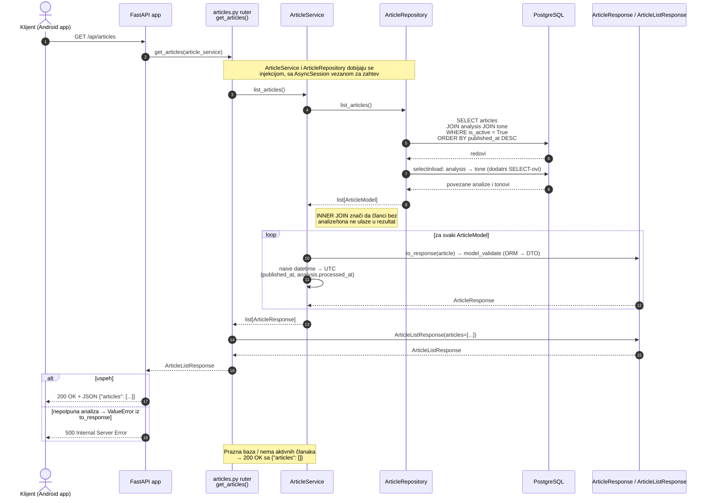

# Dohvatanje svih artikala preko API-ja

Sekvencijalni dijagram obrade HTTP zahteva `GET /api/articles`.

```mermaid
sequenceDiagram
    autonumber
    actor Client as Klijent (Android app)
    participant API as FastAPI app
    participant Route as articles.py ruter<br/>get_articles()
    participant Svc as ArticleService
    participant Repo as ArticleRepository
    participant DB as PostgreSQL
    participant Schema as ArticleResponse / ArticleListResponse

    Client->>API: GET /api/articles
    API->>Route: get_articles(article_service)
    Note over Route,Repo: ArticleService i ArticleRepository dobijaju se<br/>injekcijom, sa AsyncSession vezanom za zahtev

    Route->>Svc: list_articles()
    Svc->>Repo: list_articles()
    Repo->>DB: SELECT articles<br/>JOIN analysis JOIN tone<br/>WHERE is_active = True<br/>ORDER BY published_at DESC
    DB-->>Repo: redovi
    Repo->>DB: selectinload: analysis → tone (dodatni SELECT-ovi)
    DB-->>Repo: povezane analize i tonovi
    Repo-->>Svc: list[ArticleModel]

    Note right of Svc: INNER JOIN znači da članci bez<br/>analize/tona ne ulaze u rezultat

    loop za svaki ArticleModel
        Svc->>Schema: to_response(article) → model_validate (ORM → DTO)
        Svc->>Svc: naive datetime → UTC<br/>(published_at, analysis.processed_at)
        Schema-->>Svc: ArticleResponse
    end
    Svc-->>Route: list[ArticleResponse]

    Route->>Schema: ArticleListResponse(articles=[...])
    Schema-->>Route: ArticleListResponse
    Route-->>API: ArticleListResponse

    alt uspeh
        API-->>Client: 200 OK + JSON {"articles": [...]}
    else nepotpuna analiza → ValueError iz to_response
        API-->>Client: 500 Internal Server Error
    end

    Note over Route,Svc: Prazna baza / nema aktivnih članaka<br/>→ 200 OK sa {"articles": []}
```
