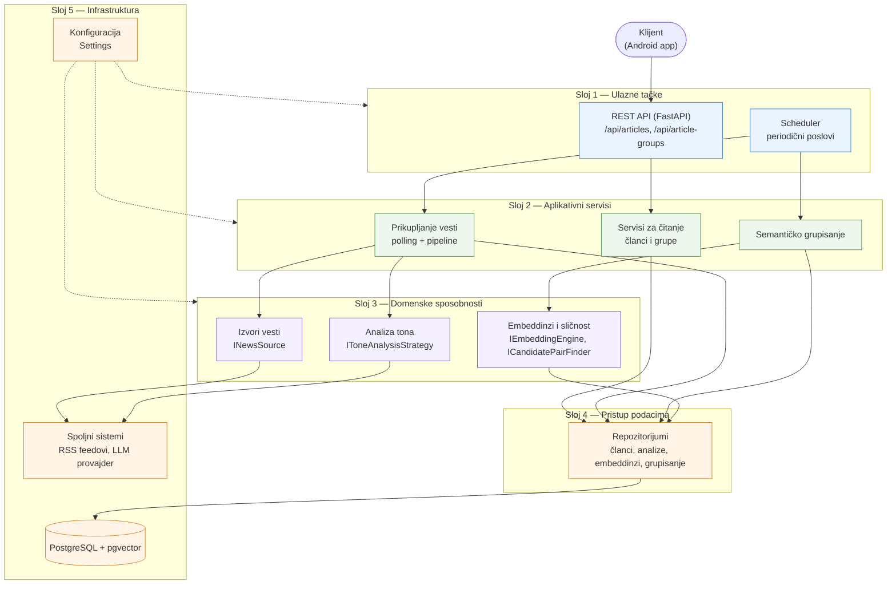

# Backend — arhitektonski pregled (najviši nivo)

Slojeviti prikaz glavnih komponenti i njihovih zavisnosti. Zavisnosti idu
nadole: API i pozadinski poslovi zavise od domenskih servisa, servisi od
repozitorijuma, repozitorijumi od baze.

## Ključne poruke za prezentaciju

- **Dve ulazne tačke**: sinhrona (HTTP zahtevi) i asinhrona (periodični
  poslovi); obe koriste iste domenske servise.
- **Zavisnosti idu samo nadole** — niži slojevi ne znaju za više.
- **Domenske sposobnosti su iza apstrakcija**, pa su implementacije
  zamenljive (izvori vesti, LLM za ton, mehanizam sličnosti).
- **Baza je jedina tačka integracije** između prikupljanja vesti,
  semantičkog grupisanja i API-ja.
- **Konfiguracija** (provajder, model, pragovi, intervali) je izdvojena i
  utiče na sve slojeve bez menjanja koda.
