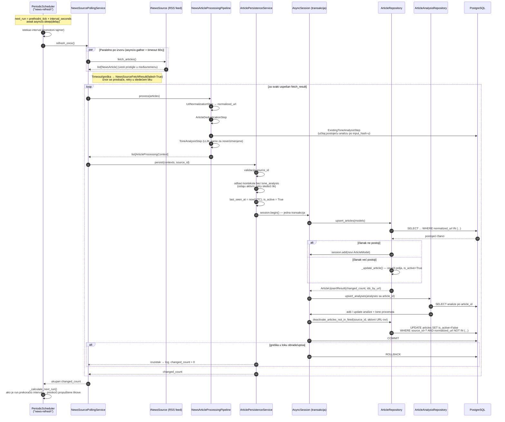

# Upis vesti u bazu nakon isteka intervala

Sekvencijalni dijagram toka koji pokreće `PeriodicScheduler` ("news-refresh")
kada istekne `news_refresh_interval_seconds`, pa sve do commit-a u bazu.

```mermaid
sequenceDiagram
    autonumber
    participant Sch as PeriodicScheduler<br/>("news-refresh")
    participant Poll as NewsSourcePollingService
    participant Src as INewsSource (RSS feed)
    participant Pipe as NewsArticleProcessingPipeline
    participant Pers as ArticlePersistenceService
    participant Sess as AsyncSession (transakcija)
    participant ARepo as ArticleRepository
    participant AnRepo as ArticleAnalysisRepository
    participant DB as PostgreSQL

    Note over Sch: next_run = prethodni_tick + interval_seconds<br/>await asyncio.sleep(delay)
    Sch->>Sch: istekao interval (monotoni tajmer)
    Sch->>Poll: refresh_once()

    par Paralelno po izvoru (asyncio.gather + timeout 60s)
        Poll->>Src: fetch_articles()
        Src-->>Poll: list[NewsArticle] (vesti pristigle u međuvremenu)
    end
    Note right of Poll: Timeout/greška → NewsSourceFetchResult(failed=True)<br/>izvor se preskače, retry u sledećem tiku

    loop za svaki uspešan fetch_result
        Poll->>Pipe: process(articles)
        Pipe->>Pipe: UrlNormalizationStep → normalized_url
        Pipe->>Pipe: ArticleDeduplicationStep
        Pipe->>DB: ExistingToneAnalysisStep<br/>(učitaj postojeću analizu po input_hash-u)
        Pipe->>Pipe: ToneAnalysisStep (LLM, samo za nove/izmenjene)
        Pipe-->>Poll: list[ArticleProcessingContext]

        Poll->>Pers: persist(contexts, source_id)
        Pers->>Pers: validacija source_id
        Pers->>Pers: odbaci kontekste bez tone_analysis<br/>(ostaju aktivni, retry sledeći tik)
        Pers->>Pers: last_seen_at = now(UTC), is_active = True

        Pers->>Sess: session.begin() — jedna transakcija
        Sess->>ARepo: upsert_articles(models)
        ARepo->>DB: SELECT ... WHERE normalized_url IN (...)
        DB-->>ARepo: postojeći članci
        alt članak ne postoji
            ARepo->>Sess: session.add(novi ArticleModel)
        else članak već postoji
            ARepo->>ARepo: _update_article() — osveži polja, is_active=True
        end
        ARepo-->>Sess: ArticleUpsertResult(changed_count, ids_by_url)

        Sess->>AnRepo: upsert_analyses(analyses sa article_id)
        AnRepo->>DB: SELECT analize po article_id
        AnRepo->>Sess: add / update analize + tone procenata

        Sess->>ARepo: deactivate_articles_not_in_feed(source_id, aktivni URL-ovi)
        ARepo->>DB: UPDATE articles SET is_active=False<br/>WHERE source_id=? AND normalized_url NOT IN (...)

        Sess->>DB: COMMIT
        alt greška u toku obrade/upisa
            Sess->>DB: ROLLBACK
            Pers--xPoll: izuzetak → log, changed_count = 0
        end
        Pers-->>Poll: changed_count
    end

    Poll-->>Sch: ukupan changed_count
    Sch->>Sch: _calculate_next_run()<br/>ako je run prekoračio interval → preskoči propuštene tikove
```
