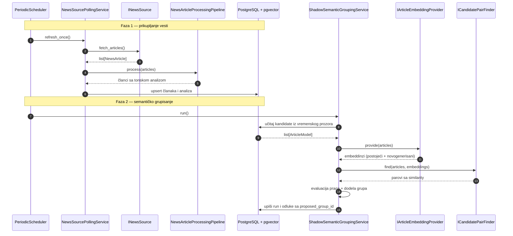

# Od fetchovanja vesti do upisa semantičke grupe u bazu

Dva nezavisna schedulera komuniciraju preko baze: prvi upisuje članke,
drugi ih naknadno grupiše.

```mermaid
sequenceDiagram
    autonumber
    participant Sch as PeriodicScheduler
    participant Poll as NewsSourcePollingService
    participant Src as INewsSource
    participant Pipe as NewsArticleProcessingPipeline
    participant DB as PostgreSQL + pgvector
    participant Shadow as ShadowSemanticGroupingService
    participant Emb as IArticleEmbeddingProvider
    participant Finder as ICandidatePairFinder

    Note over Sch,DB: Faza 1 — prikupljanje vesti
    Sch->>Poll: refresh_once()
    Poll->>Src: fetch_articles()
    Src-->>Poll: list[NewsArticle]
    Poll->>Pipe: process(articles)
    Pipe-->>Poll: članci sa tonskom analizom
    Poll->>DB: upsert članaka i analiza

    Note over Sch,DB: Faza 2 — semantičko grupisanje
    Sch->>Shadow: run()
    Shadow->>DB: učitaj kandidate iz vremenskog prozora
    DB-->>Shadow: list[ArticleModel]
    Shadow->>Emb: provide(articles)
    Emb-->>Shadow: embeddinzi (postojeći + novogenerisani)
    Shadow->>Finder: find(articles, embeddings)
    Finder-->>Shadow: parovi sa similarity
    Shadow->>Shadow: evaluacija praga + dodela grupa
    Shadow->>DB: upiši run i odluke sa proposed_group_id
```
