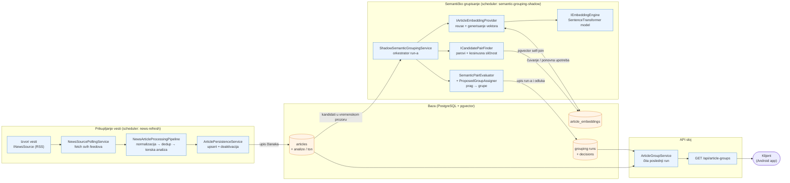

# Semantičko grupisanje — pregled komponenti (visok nivo)

Napomena: pipeline **ne poziva** `ShadowSemanticGroupingService`. Dva toka su
razdvojena i spojena preko baze — pipeline upisuje članke, a grupisanje na
svom intervalu čita ono što je upisano.

## Ključne poruke za prezentaciju

- **Razdvojeni tokovi**: prikupljanje vesti i semantičko grupisanje rade na
  zasebnim intervalima; sporo grupisanje ne usporava dohvatanje vesti.
- **Baza kao integraciona tačka**: komponente ne zovu jedna drugu direktno.
- **Apstrakcije**: `INewsSource`, `IArticleEmbeddingProvider`,
  `IEmbeddingEngine`, `ICandidatePairFinder` — zamenljive implementacije
  (npr. pgvector u Postgresu vs. Python fallback).
- **Šta se čuva**: članci + tonska analiza, embeddinzi (keširani po hash-u
  ulaza), i run sa odlukama o parovima i predloženim grupama.
- **API samo čita** rezultat poslednjeg run-a — bez računanja u zahtevu.
