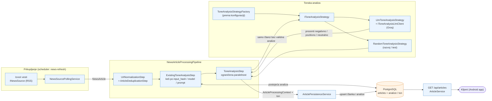

# Analiza tona — pregled komponenti (visok nivo)

Tok od RSS fetch-a do upisane tonske analize, apstrahovan na glavne
komponente u interakciji.

## Ključne poruke za prezentaciju

- **Analiza se ne ponavlja bez potrebe**: `ExistingToneAnalysisStep` po
  `input_hash`-u (naslov + sažetak) i po provajderu/modelu/verziji prompta
  odlučuje da li se postojeći rezultat može ponovo iskoristiti.
- **Strategija je zamenljiva**: `IToneAnalysisStrategy` — LLM (Groq) u
  produkciji, `Random` za razvoj; bira je fabrika iz konfiguracije.
- **Otpornost**: neuspela analiza jednog članka ne ruši ceo feed — članak se
  preskače pri upisu i pokušava se ponovo u sledećem ciklusu.
- **Performanse**: pozivi modela idu paralelno uz ograničenje broja
  istovremenih zahteva (semafor).
- **Normalizacija rezultata**: procenti se skaliraju da u zbiru daju 100%.
